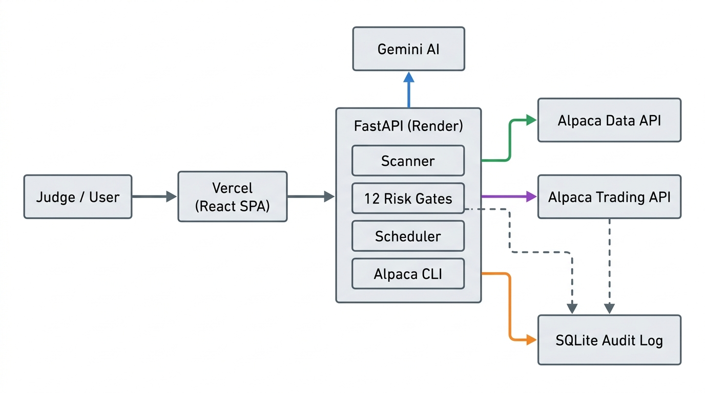

# FlightDeck Alpha 🛩️

**The thesis: AI can reason, but code should control risk.**

FlightDeck Alpha is an autonomous AI options trading agent built for the **Alpaca AI Trading Agents Hackathon**. It uses Gemini to analyze market setups and propose defined-risk options strategies. However, before any order reaches Alpaca's paper execution, it must survive 18 strict, deterministic risk gates. 

Everything the agent thinks and executes is recorded into a SQLite database, creating a 100% transparent and replayable audit trail.

---

## 🚀 Live Demo
* **Deployed App (Vercel + Render):** [Your Vercel URL Here]
* **One-Page Write-up:** [Read the full write-up](docs/one-page-writeup.md)
* **Architecture Deep Dive:** [View the diagram](docs/architecture-diagram.md)

---

## 🧠 How It Works

### 1. Autonomous Scanning (Gemini AI)
On a cron schedule, the agent pulls live options chains for highly liquid tickers (like SPY, QQQ, AAPL) using the Alpaca Data API. This data is fed to Gemini 3.7 Flash, which acts as our analyst to spot defined-risk setups (debit spreads) and generate a structured trade proposal with a written thesis. 

### 2. The Deterministic Risk Gates
The AI is **never** allowed to execute trades on its own. Every proposal hits our Risk Gates. The FastAPI backend runs 18 hardcoded checks (e.g., max daily drawdown, spread width, max premium deployed). It completely blocks naked options. If a proposal fails even one check, it is immediately killed.

### 3. Alpaca Execution & CLI Proof
If approved, the backend executes the paper trade via the Alpaca API. To prove the execution and validate the infrastructure, we also embedded the **Alpaca CLI** directly into the Docker container, verifying live positions via stdout logs.

### 4. The Flight Record (Audit Trail)
Every scan, AI thesis, risk check, and order is logged. The React frontend features a "Replay" dashboard where you can step through the agent's exact thought process.

---

## 🏗️ Architecture



---

## 💻 Tech Stack
* **Frontend:** React, Vite, Tailwind CSS, TypeScript
* **Backend:** FastAPI, Python 3.12, Uvicorn
* **AI:** Google Gemini (via OpenAI compatibility)
* **Broker:** Alpaca Paper Trading API & Data API
* **Database:** SQLite
* **Infrastructure:** Docker, Render (Backend), Vercel (Frontend)

---

## 🛠️ Local Setup

1. **Clone & Environment:**
```bash
cp .env.example .env
```
*Add your Alpaca Paper credentials and Gemini API key to the `.env` file.*

2. **Run the Backend:**
```bash
cd backend
python -m venv .venv
source .venv/bin/activate  # (On Windows: .\.venv\Scripts\Activate.ps1)
pip install -r requirements.txt
uvicorn app.main:app --reload
```

3. **Run the Frontend:**
```bash
cd frontend
npm install
npm run dev
```
*The Vite dev server will run on port 5173 and proxy API requests to 8000.*

## 📚 Documentation
Check out the `docs/` folder for deeper engineering details:
- [One-Page Write-up](docs/one-page-writeup.md)
- [Architecture Diagram](docs/architecture-diagram.md)
- [Mega System Reference](docs/MEGA_SYSTEM_REFERENCE.md)
- [Backtesting Strategy](docs/backtesting.md)
