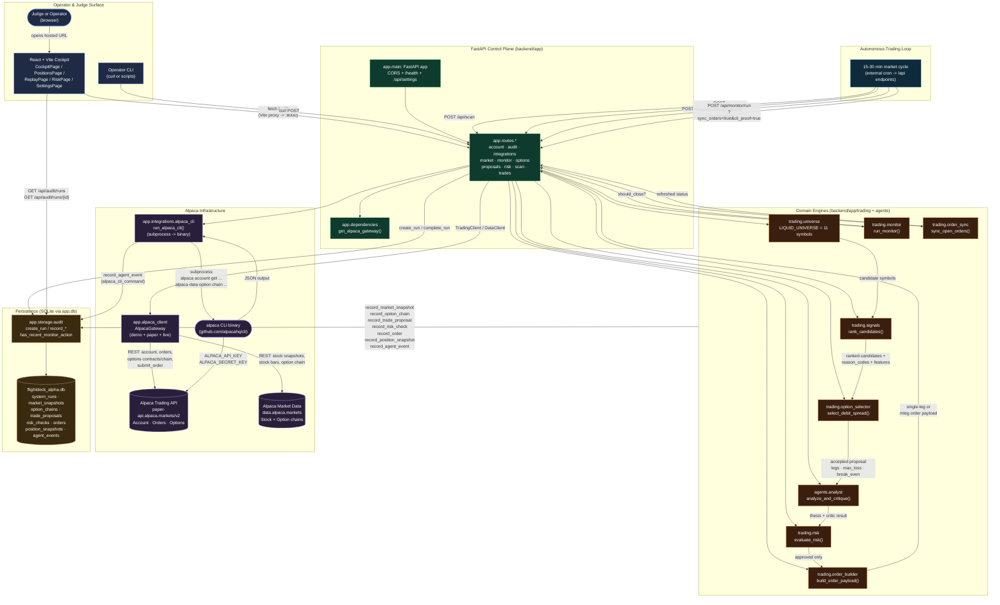

# FlightDeck Alpha — Architecture Diagram

Source-of-truth architecture for the FlightDeck Alpha autonomous options-trading agent. Rendered natively in GitHub, VS Code, and most Mermaid-compatible viewers.

The diagram is split into logical layers: the **operator surface** (top), the **FastAPI control plane** (middle), the **Alpaca infrastructure** (right), the **persistence / audit store** (left), and the **autonomous pipeline** (bottom).

## Reading the diagram

- **Surface -> API**: every UI screen and CLI command goes through the same FastAPI routers in `backend/app/routes/`. There is no side channel.
- **Domain -> Gateway -> Alpaca**: deterministic code in `backend/app/trading/*` never touches the network directly. It calls `AlpacaGateway` (`backend/app/alpaca_client.py`), which switches between `demo_data.py` and the live `alpaca-py` SDK based on `DEMO_MODE` and `ALPACA_PAPER`.
- **Audit-first**: every code path that mutates money (proposal, risk check, order, position snapshot, monitor decision, CLI command) calls into `app.storage.audit` to insert a row before returning. That is what powers the Replay page.
- **CLI is a separate edge**: `app.integrations.alpaca_cli` shells out to the `alpaca` binary (`ALPACA_CLI_BINARY`). It is the hackathon's "MCP **or** CLI" proof, and its JSON output is itself persisted as `agent_events` rows of type `alpaca_cli_command`.
- **Autonomous loop**: there is no in-process scheduler. The same endpoints can be driven by an external cron, GitHub Actions schedule, or a Render cron-job service. The minimum cycle is a `scan -> proposal -> review -> execute -> monitor` sequence, all idempotent through `client_order_id`.

## Layer boundaries (for refactors)

| Layer | Owns | Does NOT own |
|---|---|---|
| `routes/*` | HTTP shape, validation, run IDs, audit calls | Risk math, selector logic, order math |
| `trading/*` | Eligibility, sizing, risk math, order payload shape, exit rules | HTTP, persistence, Alpaca SDK construction |
| `agents/*` | LLM proposal/critique and strict-JSON parsing | Execution, risk, persistence |
| `alpaca_client.py` | SDK construction, demo vs live switching, request/response mapping | Domain logic |
| `integrations/alpaca_cli.py` | Subprocess, JSON parsing, demo fallback, audit logging | Strategy |
| `storage/audit.py` | Schema, JSON serialization, run/row helpers | Business rules |
| `frontend/src/pages/*` | Rendering, fetch, loading/error/empty states | Anything that touches Alpaca directly |

## What is intentionally not in the diagram

- **MCP server** — the hackathon accepts MCP **or** CLI. CLI is wired (`integrations/alpaca_cli.py`); MCP is not. The diagram only shows what is implemented.
- **In-process scheduler** — the design uses external triggers (cron, GH Actions, Render Cron) calling the same endpoints. This keeps the process stateless and easy to redeploy.
- **Live trading** — every `ALPACA_PAPER` switch and risk-gate branch is hard-coded to refuse live mode (`trading/risk.py:32`, `max_drawdown_pct` default `8.0`).
