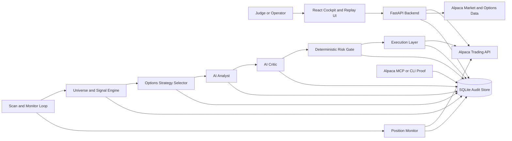

# FlightDeck Alpha Architecture

This is the architecture placeholder for the hackathon build. It should become the source diagram for the README, deck, and demo video.

## Control Boundaries

- The AI analyst and critic explain structured facts and proposals.
- Deterministic code owns contract eligibility, risk sizing, and execution approval.
- Alpaca paper trading is the only supported execution environment.
- Demo mode must populate the dashboard and replay screens without live credentials or an open market.

## Core Data Flow

1. The scanner ranks liquid symbols with explainable market features.
2. The options selector turns a directional candidate into a debit spread or a clear rejection.
3. The analyst emits a strict JSON thesis from structured facts.
4. The critic validates the thesis and requests rejection or revision when needed.
5. The risk gate applies hard limits and returns machine-readable reasons.
6. The executor submits only approved paper orders and persists the request and response.
7. The monitor tracks open orders, positions, P&L, and exit rules.
8. The dashboard reads from API endpoints and the audit trail for live cockpit and replay views.
